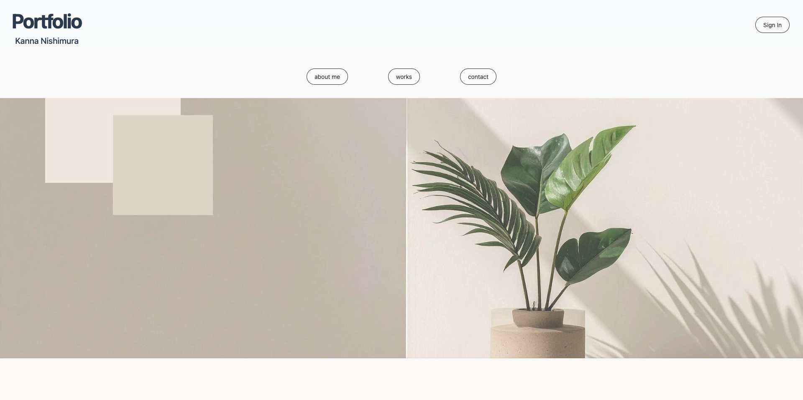
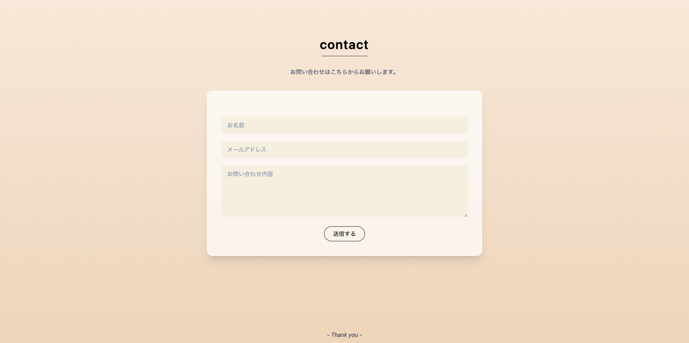
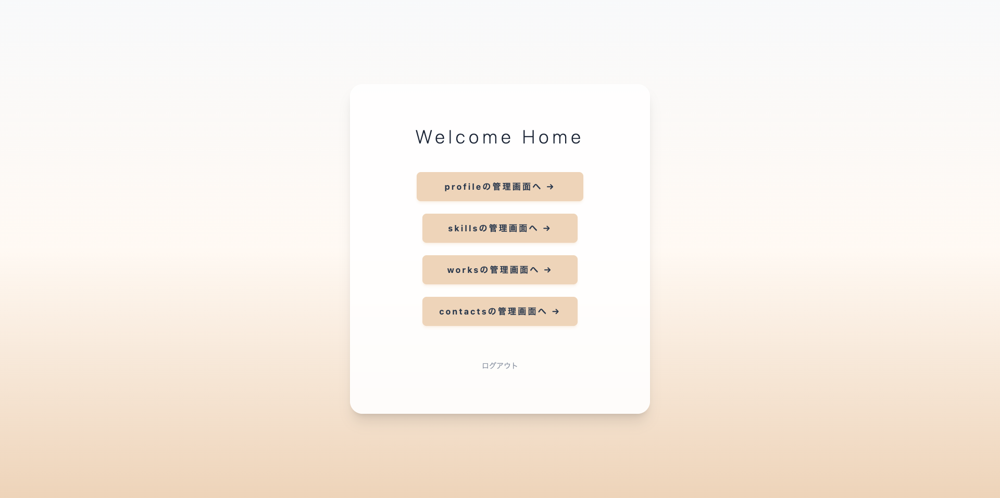
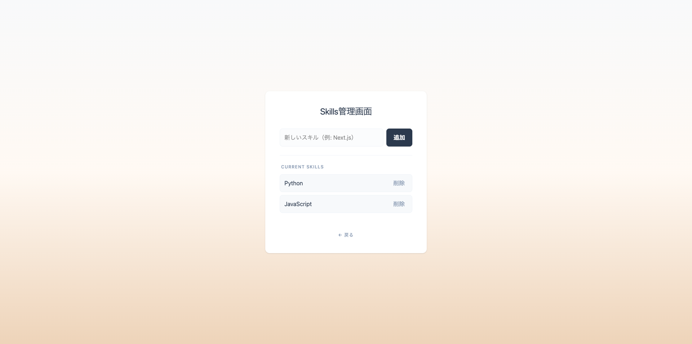

# Portfolio

管理画面付きポートフォリオサイトです。  
実績・スキルの公開に加え、管理画面からコンテンツのCRUD操作が可能です。

---

## 🚀 システム構成

フロントエンド・バックエンドを分離した構成を採用し、実務に近いアーキテクチャで開発しています。

- **Frontend**: Next.js (App Router) によるSSR対応
- **Backend**: Express.js によるREST API構築
- **Database**: MySQL（Docker上）を Prisma で操作
- **Authentication**: Firebase Authentication による認証・認可制御

---

## 🛠 技術スタック

| 分類     | 技術                    | 用途                 |
| -------- | ----------------------- | -------------------- |
| Frontend | Next.js (App Router)    | UI構築 / SSR         |
|          | TypeScript              | 型安全な開発         |
|          | Tailwind CSS            | スタイリング         |
| Backend  | Express.js              | REST API             |
|          | TypeScript              | 型安全なサーバー開発 |
| Database | MySQL                   | データ永続化         |
|          | Prisma ORM              | DB操作（ORM）        |
| Auth     | Firebase Authentication | 認証・認可           |

---

## イメージ

### トップページ



### お問い合わせフォーム



### 管理画面



### スキル管理画面



---

## 🎯 主な機能

### 公開ページ

- プロフィール表示
- 実績一覧表示
- スキル一覧
- お問い合わせフォーム

### 管理画面（認証必須）

- 実績の作成 / 編集 / 削除（CRUD）
- スキルの追加 / 削除
- プロフィール編集
- コンタクトの表示 / 削除
- ログインユーザーのみアクセス可能（認可制御）

### 🔒 認証・認可

- Firebase Authentication を利用
- 未ログイン時は管理画面へアクセス不可
- Route Groups を利用して認証ページを分離

---

## 📁 ディレクトリ構成

```text
.
|- frontend/
|  |- src/app/
|  |- lib/
|  `- public/
|
|- backend/
|  |- src/
|  |  |- controllers/
|  |  |- routes/
|  |  `- index.ts
|  `- prisma/
|
|- docker-compose.yml
|- Dockerfile
|- .gitignore
`- README.md
```

## ⚙️ セットアップ手順

### 1. リポジトリをクローン

```bash
git clone <your-repository-url>
cd <repository-name>
```

### 2. データベースの起動

```bash
docker-compose up -d
```

### 3. バックエンドの起動

```bash
cd backend

npm install

npx prisma db push

npm run dev
```

### 4. フロントエンドの起動

```bash
cd frontend

npm install

npm run dev
```

### 5. アクセス

```bash
http://localhost:3000
```

---

## 💡 工夫した点

- frontend / backend を分離した構成を採用
- API通信を lib/api に集約し責務分離
- Prisma による型安全なDB操作
- App Router の Route Groups による認証制御

---

## 今後の改善予定 ✍️

- 画像アップロード機能
- バリデーション強化
- E2Eテスト導入
- CI/CD構築

---

## 📝ドキュメント

- [Frontend README ](./frontend/README.md)
- [Backend README](./backend/README.md)
- [API設計書](./docs/API.md)
- [アーキテクチャ図](./docs/architecture.png)
